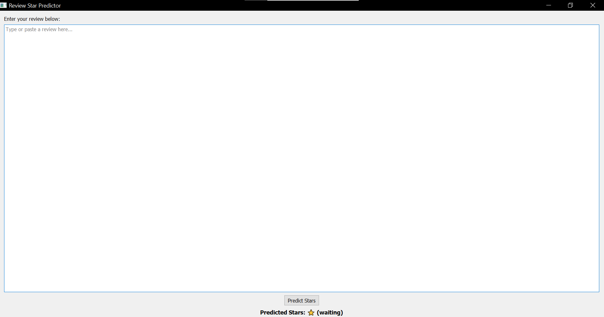
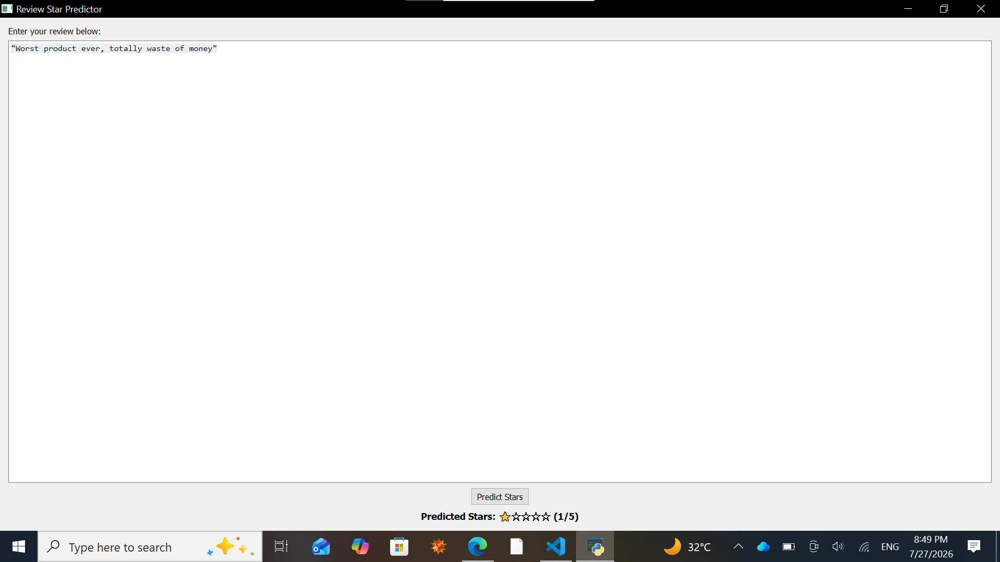
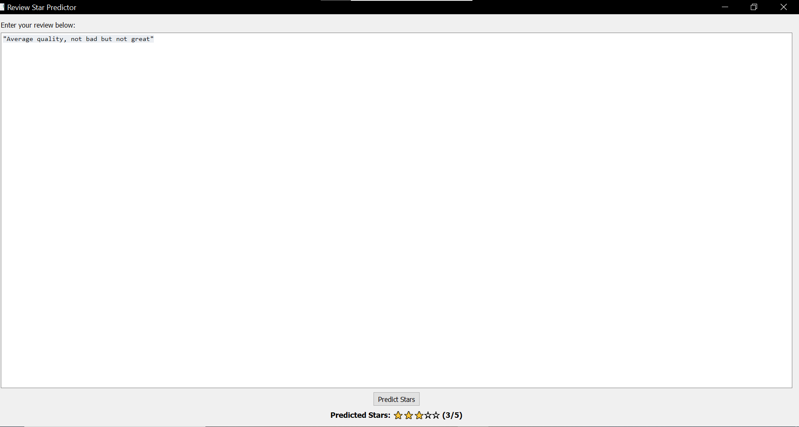

# ⭐ Review Star Predictor

A desktop application that predicts a **1-5 star rating** from the text of a customer review, using a **TF-IDF + Linear Regression** model wrapped in a clean **PyQt5** GUI.

Type or paste any review — the app instantly predicts how many stars it deserves.

---

## 📸 Demo

| Empty State | Negative Review |
|:---:|:---:|
|  |  |

| Neutral Review | Positive Review |
|:---:|:---:|
|  |  |

---

## ✨ Features

- 🖥️ Clean, minimal desktop GUI built with **PyQt5**
- 🧠 Text classification powered by **TF-IDF vectorization + Linear Regression**
- ⭐ Instant star-rating prediction (1 to 5), with visual star display
- ⚠️ Input validation — warns the user if the review box is left empty
- 📦 Model is trained once and reused via a serialized `model.pkl`

---

## 🛠️ Tech Stack

| Component | Technology |
|---|---|
| Language | Python 3 |
| GUI Framework | PyQt5 |
| ML Library | scikit-learn |
| Feature Extraction | TF-IDF (`TfidfVectorizer`) |
| Model | Linear Regression |
| Data Handling | pandas |
| Serialization | pickle |

---

## 📁 Project Structure

```
review-star-predictor/
├── predict_gui.py        # PyQt5 desktop app (loads model.pkl and predicts)
├── train_model.py         # Trains the TF-IDF + Linear Regression model
├── model.pkl               # Pre-trained model (vectorizer + regressor)
├── requirements.txt      # Python dependencies
├── data/
│   └── reviews.csv         # Sample labelled review dataset
├── screenshots/            # App screenshots used in this README
├── LICENSE
└── README.md
```

---

## ⚙️ Installation

1. **Clone the repository**
   ```bash
   git clone https://github.com/<your-username>/review-star-predictor.git
   cd review-star-predictor
   ```

2. **Install dependencies**
   ```bash
   pip install -r requirements.txt
   ```

---

## ▶️ Usage

### Option 1 — Use the pre-trained model
A trained `model.pkl` is already included. Just launch the app:
```bash
python predict_gui.py
```

### Option 2 — Retrain the model from scratch
```bash
python train_model.py     # regenerates model.pkl from data/reviews.csv
python predict_gui.py     # launch the GUI
```

Type a review into the text box and click **Predict Stars** to see the result.

---

## 🧠 How It Works

1. **`train_model.py`** reads labelled reviews from `data/reviews.csv` (review text + star rating).
2. Review text is converted into numeric features using **TF-IDF** (`max_features=1000`).
3. A **Linear Regression** model is fitted to predict the star rating from those features.
4. The fitted vectorizer and model are bundled together and saved as `model.pkl`.
5. **`predict_gui.py`** loads `model.pkl`, transforms new review text through the same vectorizer, and rounds the model's numeric output to the nearest whole star (clipped between 1 and 5).

---

## 📊 Model Details & Evaluation

The included dataset (`data/reviews.csv`) contains **25 hand-labelled sample reviews** spanning all 5 star ratings, intended as a lightweight demo dataset for this project.

On an 80/20 train-test split of this sample data:

| Metric | Value |
|---|---|
| Mean Absolute Error (MAE) | ~1.7 stars |
| Predictions within ±1 star of actual | 40% |

**Note on limitations:** With only 25 samples, this is a small demonstration dataset rather than a production-grade one — the model is meant to show the end-to-end pipeline (data → TF-IDF → regression → GUI), not to achieve high accuracy. On the clearly positive/negative examples shown in the screenshots above, predictions look sensible, but performance on more nuanced or longer reviews will be inconsistent until the model is trained on a much larger, more diverse dataset (hundreds or thousands of labelled reviews).

---

## 🚀 Future Improvements

- [ ] Train on a larger, real-world review dataset (e.g. Amazon/Yelp reviews)
- [ ] Replace Linear Regression with a classification model (e.g. Logistic Regression, SVM, or a fine-tuned transformer) since star ratings are ordinal categories, not a continuous value
- [ ] Add text preprocessing (stopword removal, stemming/lemmatization)
- [ ] Add a confidence score alongside the predicted rating
- [ ] Package as a standalone `.exe` using PyInstaller

---

## 👩‍💻 Author

**Faiza Shaukat**
BS Artificial Intelligence, University of Haripur
AI/ML Internship Program — M-Tech Production & Marketing

---

## 📄 License

This project is licensed under the [MIT License](LICENSE).
